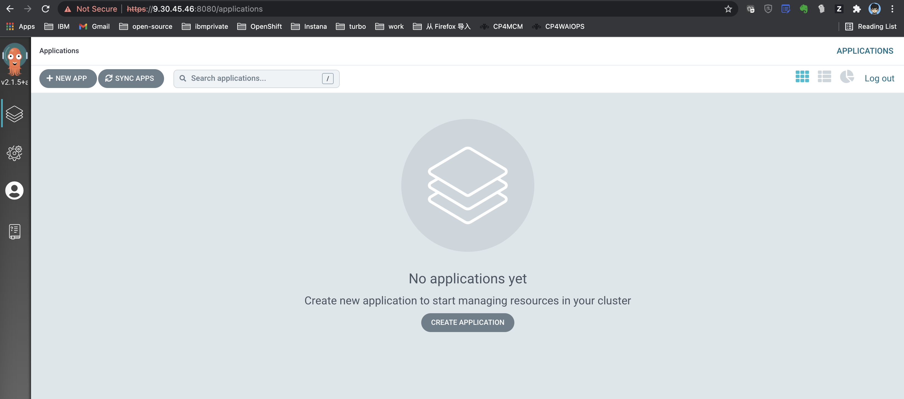

<!-- START doctoc generated TOC please keep comment here to allow auto update -->
<!-- DON'T EDIT THIS SECTION, INSTEAD RE-RUN doctoc TO UPDATE -->
**Table of Contents**  *generated with [DocToc](https://github.com/thlorenz/doctoc)*

- [GitOps Quick Start with Kubernetes KIND Cluster](#gitops-quick-start-with-kubernetes-kind-cluster)
  - [Create a KIND Cluster](#create-a-kind-cluster)
  - [Install Argo CD](#install-argo-cd)
  - [Download Argo CD CLI](#download-argo-cd-cli)
  - [Enable NodePort for Argo CD server](#enable-nodeport-for-argo-cd-server)
  - [Access The Argo CD API Server](#access-the-argo-cd-api-server)
    - [Get Argo CD password](#get-argo-cd-password)
    - [Access via CLI](#access-via-cli)
    - [Access via UI](#access-via-ui)
  - [Deploy a Sample App](#deploy-a-sample-app)
  - [Install Crossplane (Optional)](#install-crossplane-optional)
    - [Install Helm 3](#install-helm-3)
    - [Install Crossplane](#install-crossplane)
    - [Verify Crossplane Install](#verify-crossplane-install)

<!-- END doctoc generated TOC please keep comment here to allow auto update -->

# GitOps Quick Start with Kubernetes KIND Cluster

This is a tutorial for how to run a very simple GitOps demo with Kubernetes KIND Cluster. The demo is trying to use both `argocd` CLI and UI.

For UI, the tutorial is using `NodePort` with Kubernetes KIND Cluster to enable end user can login to the argoCD UI.

## Create a KIND Cluster

First we need create a Cluster config for KIND with `extraPortMappings`, this can enable `NodePort` for this KIND cluster for future access of argocd UI.

```yaml
kind: Cluster
apiVersion: kind.x-k8s.io/v1alpha4
nodes:
- role: control-plane
  extraPortMappings:
  - containerPort: 31923
    hostPort: 8080
```

Save above file as `cluster.yaml` and run the following command to deploy the KIND cluster:

```console
kind create cluster --config cluster.yaml --name argocd
```

The output of the above command can be as follows:

```console
root@gyliu-dev21:~/kind# kind create cluster --config cluster.yaml --name argocd
Creating cluster "argocd" ...
 ✓ Ensuring node image (kindest/node:v1.21.1) 🖼
 ✓ Preparing nodes 📦
 ✓ Writing configuration 📜
 ✓ Starting control-plane 🕹️
 ✓ Installing CNI 🔌
 ✓ Installing StorageClass 💾
Set kubectl context to "kind-argocd"
You can now use your cluster with:

kubectl cluster-info --context kind-argocd

Thanks for using kind! 😊
```

After the `kind create` finished, check all nodes are ready:

```
kubectl get nodes
```

The output of the above command can be as follows:

```console
root@gyliu-dev21:~/kind# kubectl get nodes
NAME                   STATUS   ROLES                  AGE     VERSION
argocd-control-plane   Ready    control-plane,master   4m28s   v1.21.1
```

## Install Argo CD

Checkout [Argo CD quickstart](https://argo-cd.readthedocs.io/en/stable/getting_started/) to get more detail, here we will show some key steps to help you go through the tutorial here.

```
kubectl create namespace argocd
kubectl apply -n argocd -f https://raw.githubusercontent.com/argoproj/argo-cd/stable/manifests/install.yaml
```

## Download Argo CD CLI

The tutorial here was running on Linux amd64, so the CLI that I used is as follows:

```
curl -sSL -o /usr/local/bin/argocd https://github.com/argoproj/argo-cd/releases/latest/download/argocd-linux-amd64
chmod +x /usr/local/bin/argocd
```
## Enable NodePort for Argo CD server

In the tutorial, `NodePort` was enabled in the KIND Cluster, so here we will use `NodePort` to access the Argo CD server.

```console
root@gyliu-dev21:~# kubectl get svc -n argocd
NAME                    TYPE        CLUSTER-IP      EXTERNAL-IP   PORT(S)                      AGE
argocd-dex-server       ClusterIP   10.96.19.236    <none>        5556/TCP,5557/TCP,5558/TCP   2m53s
argocd-metrics          ClusterIP   10.96.199.1     <none>        8082/TCP                     2m53s
argocd-redis            ClusterIP   10.96.211.183   <none>        6379/TCP                     2m53s
argocd-repo-server      ClusterIP   10.96.146.212   <none>        8081/TCP,8084/TCP            2m53s
argocd-server           ClusterIP   10.96.163.35    <none>        80/TCP,443/TCP               2m53s
argocd-server-metrics   ClusterIP   10.96.16.62     <none>        8083/TCP                     2m53s
```

Here we need to update the service `argocd-server` and enable it to use `NodePort` via following CLI:

```
kubectl edit svc -n argocd argocd-server
```

After update, you can see the `argocd-server` `PORT(S)` is as follows:

```console
root@gyliu-dev21:~# kubectl get svc -n argocd argocd-server
NAME            TYPE       CLUSTER-IP     EXTERNAL-IP   PORT(S)                      AGE
argocd-server   NodePort   10.96.163.35   <none>        80:31328/TCP,443:31923/TCP   7m16s
```

NOTE: Make sure `443` map to `31923` as we configured in `cluster.yaml`, so that you can access the Argo CD UI via `https://<Host IP Where your KIND Cluster is running>:8080`.

In the tutorial, the host IP is `9.30.45.46`, so we are using `https://9.30.45.46:8080/` to access the argocd UI.

You can navigate to your Argo CD UI now!


## Access The Argo CD API Server

### Get Argo CD password

The initial password for the `admin` account is auto-generated and stored as clear text in the field `password` in a secret named `argocd-initial-admin-secret` in your Argo CD installation namespace. You can simply retrieve this password using kubectl:

```
kubectl -n argocd get secret argocd-initial-admin-secret -o jsonpath="{.data.password}" | base64 -d && echo
```

### Access via CLI

You can login via CLI as follows:

```
argocd login <ARGOCD_SERVER>
```

For the tutorial here, we can use the CLI:

```console
root@gyliu-dev21:~# argocd login 9.30.45.46:8080
WARNING: server certificate had error: x509: cannot validate certificate for 9.30.45.46 because it doesn't contain any IP SANs. Proceed insecurely (y/n)? y
Username: admin
Password:
'admin:login' logged in successfully
Context '9.30.45.46:8080' updated
```

### Access via UI

Input username `admin` and password, you will be able to login to Argo CD UI.



## Deploy a Sample App

Refer to [Create An Application From A Git Repository](https://argo-cd.readthedocs.io/en/stable/getting_started/#6-create-an-application-from-a-git-repository) to deploy your sample GitOps Apps, good luck!

## Install Crossplane (Optional)

If you are using [Crossplane](https://crossplane.io/) providers for GitOps, you may want to install Crossplane in the Kubernetes KIND Cluster as well.

Check [ Self-Hosted Crossplane Install](https://crossplane.io/docs/v1.4/getting-started/install-configure.html) for some detail guidance, the following are some simple commands which can help install Crossplane quickly in your Kubernetes KIND Cluster.

Use `Helm 3` to install the `latest` official stable release of Crossplane, suitable for community use and testing

### Install Helm 3

```
curl -fsSL -o get_helm.sh https://raw.githubusercontent.com/helm/helm/main/scripts/get-helm-3
chmod 700 get_helm.sh
./get_helm.sh
```

### Install Crossplane
```
kubectl create namespace crossplane-system

helm repo add crossplane-stable https://charts.crossplane.io/stable
helm repo update

helm install crossplane --namespace crossplane-system crossplane-stable/crossplane
```

### Verify Crossplane Install

```
helm list -n crossplane-system

kubectl get all -n crossplane-system
```

The output of above two commands in my cluster is as follows:

```console
root@gyliu-dev21:~# helm list -n crossplane-system
NAME      	NAMESPACE        	REVISION	UPDATED                                	STATUS  	CHART           	APP VERSION
crossplane	crossplane-system	1       	2021-10-25 00:54:58.859431594 -0700 PDT	deployed	crossplane-1.4.1	1.4.1
```
```console
root@gyliu-dev21:~# kubectl get all -n crossplane-system
NAME                                          READY   STATUS    RESTARTS   AGE
pod/crossplane-6f974db97-sqrst                1/1     Running   0          39m
pod/crossplane-rbac-manager-dd8d65f77-sgkj9   1/1     Running   0          39m

NAME                                      READY   UP-TO-DATE   AVAILABLE   AGE
deployment.apps/crossplane                1/1     1            1           39m
deployment.apps/crossplane-rbac-manager   1/1     1            1           39m

NAME                                                DESIRED   CURRENT   READY   AGE
replicaset.apps/crossplane-6f974db97                1         1         1       39m
replicaset.apps/crossplane-rbac-manager-dd8d65f77   1         1         1       39m
```