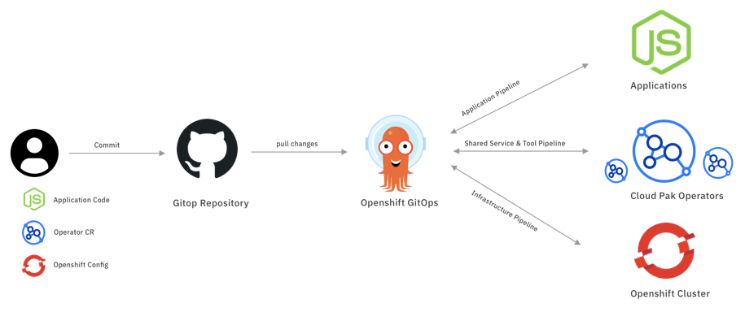

<!-- START doctoc generated TOC please keep comment here to allow auto update -->
<!-- DON'T EDIT THIS SECTION, INSTEAD RE-RUN doctoc TO UPDATE -->
**Table of Contents**  *generated with [DocToc](https://github.com/thlorenz/doctoc)*

- [CloudPakOps](#cloudpakops)
  - [What is CloudPakOps](#what-is-cloudpakops)
  - [Why CloudPakOps](#why-cloudpakops)
  - [Use Cases](#use-cases)
  - [What we have done](#what-we-have-done)
  - [Under Going](#under-going)
  - [Plan](#plan)

<!-- END doctoc generated TOC please keep comment here to allow auto update -->

<!--
 Copyright 2021 guangyaliu
 
 Licensed under the Apache License, Version 2.0 (the "License");
 you may not use this file except in compliance with the License.
 You may obtain a copy of the License at
 
     http://www.apache.org/licenses/LICENSE-2.0
 
 Unless required by applicable law or agreed to in writing, software
 distributed under the License is distributed on an "AS IS" BASIS,
 WITHOUT WARRANTIES OR CONDITIONS OF ANY KIND, either express or implied.
 See the License for the specific language governing permissions and
 limitations under the License.
-->

# CloudPakOps

## What is CloudPakOps

CloudPakOps is enabling the customer to manage the IBM Cloud Paks with GitOps. The CloudPakOps is covering GitOps for three layers, including infrastructure, Cloud Pak and application layer.

## Why CloudPakOps

With CloudPakOps, the end user only need to have a Kubernetes/OpenShift Cluster with Argo CD installed, then they will be able to use the CloudPakOps to manage everything for IBM Cloud Pak. The Argo CD will be acted as the `top level orchstrator` to orchestrate the whole platform.

## Use Cases

- As a Cluster Admin, I want to install Cloud Pak automatically without any manual operations. (Automatic Install)
- As a Cluster Admin, I want to install Cloud Pak from scratch using GitOps, and track the Cluster update via Git Commit log. (Day 1 Operation)
- As a Cluster Admin, I want to modify, upgrade existing Cloud Pak deployment using GitOps. (Day 2 Operation)
- As a Cluster Admin, I want to have the same install experience for all Cloud Paks via GitOps. (Consistent Install Experience)
- As a Cluster Admin, I want to install Cloud Pak in airgap environment using GitOps. (Airgap Install)
- As a Cluster Admin, I want to provision OpenShift cluster using GitOps. (OCP Provisioning)
- As a Cluster Admin, I want to promote Cloud Pak from development, staging, to production environment using GitOps. (Continuous Delivery)
- As an Application Developer, I want to deploy applications to IBM Cloud Paks via GitOps. (Application Deployment)

## What we have done

We have enabled GitOps for [IBM Cloud Pak for Watson AIOps](https://www.ibm.com/cloud/cloud-pak-for-watson-aiops), [Instana](https://www.turbonomic.com/) and [Turbonomic](https://www.instana.com/).

- [Using GitOps to manage IBM Cloud Pak for Watson AIOps](https://github.com/cloud-pak-gitops/cp4waiops-gitops)
- [Using GitOps to manage Instana](https://github.com/cloud-pak-gitops/instana-gitops)
- [Using GitOps to manage Turbonomic](https://github.com/cloud-pak-gitops/turbo-gitops)

## Under Going

- [Using GitOps to manage OpenShift Cluster](https://github.com/cloud-pak-gitops/openshift-gitops)
- [Using GitOps to manage Sample Apps for IBM Cloud Pak for Watson AIOps](https://github.com/cloud-pak-gitops/sample-app-gitops)

## Plan

Build up a open source community for All IBM Cloud Pak GitOps.

