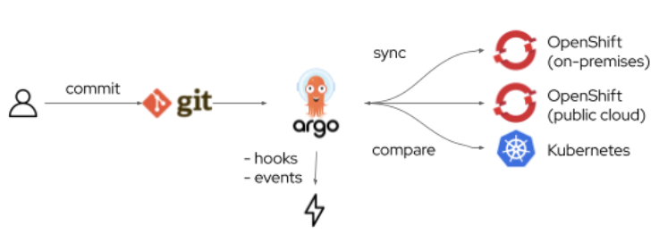

<!-- START doctoc generated TOC please keep comment here to allow auto update -->
<!-- DON'T EDIT THIS SECTION, INSTEAD RE-RUN doctoc TO UPDATE -->
**Table of Contents**  *generated with [DocToc](https://github.com/thlorenz/doctoc)*

- [What is GitOps](#what-is-gitops)
- [OpenShift GitOps](#openshift-gitops)

<!-- END doctoc generated TOC please keep comment here to allow auto update -->

# What is GitOps

GitOps is a declarative way to implement continuous deployment for cloud native applications. You can use GitOps to create repeatable processes for managing OpenShift Container Platform clusters and applications across multi-cluster Kubernetes environments. GitOps handles and automates complex deployments at a fast pace, saving time during deployment and release cycles.

The GitOps workflow pushes an application through development, testing, staging, and production. GitOps either deploys a new application or updates an existing one, so you only need to update the repository; GitOps automates everything else.

GitOps is a set of practices that use Git pull requests to manage infrastructure and application configurations. In GitOps, the Git repository is the only source of truth for system and application configuration. This Git repository contains a declarative description of the infrastructure you need in your specified environment and contains an automated process to make your environment match the described state. Also, it contains the entire state of the system so that the trail of changes to the system state are visible and auditable. By using GitOps, you resolve the issues of infrastructure and application configuration sprawl.

GitOps defines infrastructure and application definitions as code. Then, it uses this code to manage multiple workspaces and clusters to simplify the creation of infrastructure and application configurations. By following the principles of the code, you can store the configuration of clusters and applications in Git repositories, and then follow the Git workflow to apply these repositories to your chosen clusters. You can apply the core principles of developing and maintaining software in a Git repository to the creation and management of your cluster and application configuration files.

# OpenShift GitOps

OpenShift GitOps is an OpenShift add-on which provides Argo CD and other tooling to enable teams to implement GitOps workflows for cluster configuration and application delivery.  OpenShift GitOps is available as an operator in the OperatorHub and can be installed with  a simple one-click experience. Once installed, users can deploy Argo CD instances using Kubernetes custom resources.

Using Argo CD, teams can sync the state of OpenShift and Kubernetes cluster configurations and application deployments with Git repositories either manually or automatically with any change made in the Git repository.  Furthermore, Argo CD increases visibility into the state of clusters and applications by identifying drifts and correcting them if the cluster or workloads deviate from the desired states. Taking advantage of OpenShift GitOps with Argo CD enables teams to have full visibility and traceability into changes rolled out to clusters, whether they originate from cluster configurations or application deployments. Every change is represented with a commit in the Git history of the repository. In addition, Argo CD emits Kubernetes events  for changes pushed to the clusters in order to complement the Git history and provide a comprehensive view and timeline of updates on the cluster.

