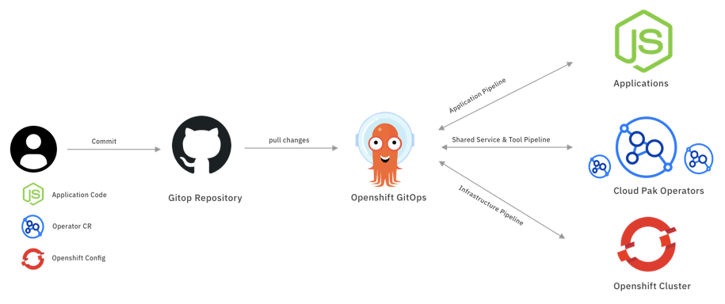

<!-- START doctoc generated TOC please keep comment here to allow auto update -->
<!-- DON'T EDIT THIS SECTION, INSTEAD RE-RUN doctoc TO UPDATE -->
**Table of Contents**  *generated with [DocToc](https://github.com/thlorenz/doctoc)*

- [GitOps Introduction](#gitops-introduction)
  - [What is GitOps](#what-is-gitops)
  - [What is CloudPakOps](#what-is-cloudpakops)

<!-- END doctoc generated TOC please keep comment here to allow auto update -->

# GitOps Introduction

## What is GitOps

GitOps is a declarative way to implement continuous deployment for cloud native applications. You can use GitOps to create repeatable processes for managing OpenShift Container Platform clusters and applications across multi-cluster Kubernetes environments. GitOps handles and automates complex deployments at a fast pace, saving time during deployment and release cycles.

The GitOps workflow pushes an application through development, testing, staging, and production. GitOps either deploys a new application or updates an existing one, so you only need to update the repository; GitOps automates everything else.

GitOps is a set of practices that use Git pull requests to manage infrastructure and application configurations. In GitOps, the Git repository is the only source of truth for system and application configuration. This Git repository contains a declarative description of the infrastructure you need in your specified environment and contains an automated process to make your environment match the described state. Also, it contains the entire state of the system so that the trail of changes to the system state are visible and auditable. By using GitOps, you resolve the issues of infrastructure and application configuration sprawl.

GitOps defines infrastructure and application definitions as code. Then, it uses this code to manage multiple workspaces and clusters to simplify the creation of infrastructure and application configurations. By following the principles of the code, you can store the configuration of clusters and applications in Git repositories, and then follow the Git workflow to apply these repositories to your chosen clusters. You can apply the core principles of developing and maintaining software in a Git repository to the creation and management of your cluster and application configuration files.

## What is CloudPakOps

CloudPakOps is enabling the customer to manage the IBM Cloud Paks with GitOps. The CloudPakOps is covering GitOps for three layers, including infrastructure, Cloud Pak and application layer.

   